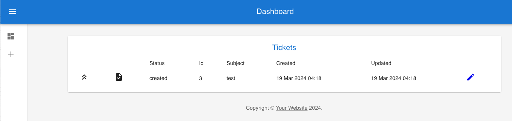

# Adventures with the CDK - AppSync
## Part 3 - the Frontend
### AWS Amplify CLI
In the previous blog I set up an AppSync API using the CDK one of the most common uses of an API is as a backend for a 
frontend so how easy is it once you've created the API to use it? To find out I [used create react app](https://create-react-app.dev/)
to get started with a skeleton app. Code to connect to the API can be generated with the AWS Amplify CLI
```shell
npx @aws-amplify/cli codegen add --apiId <...> --region <...>
```
Running the above will take you through a wizard to generate models and data access methods for more info see the [docs](https://docs.amplify.aws/javascript/build-a-backend/graphqlapi/client-code-generation/)

I added the following code to the deploy script to output the created url and api key to a config file. It's worth noting 
that for a production app we wouldn't use an api key but other options are available like a cognito or oauth. 
```shell
cat > ../react-frontend/src/appsync-config.js  <<EOM
const config =  {
    API: {
        GraphQL: {
          endpoint: '${graphqlUrl}',
          region: 'us-east-1',
          defaultAuthMode: 'apiKey',
          apiKey: '${apiKey}'
        }
    }
};
```
Amplify is configured by loading in the above config in the App.tsx file
```typescript
// @ts-ignore
Amplify.configure(config);
```
You can then create a client using the generateClient function and use it as below (where getTicketById is one of the queries generated by the CLI)
```typescript
const client = generateClient();

const result = await client.graphql({
    query: getTicketById,
    variables: {id: ticketId}
});
```

From there you can start scaffolding out a website. It's pretty easy to use the deployed site as a backend for development
which may not be possible in every case. Even with a single account for dev you could deploy the same stacks with a
different prefix if you wanted to have one for each developer. So with the site configured to use the API on AWS you can
just run `npm start` and go from there.

For me that started a process of finding out what was and wasn't working on the API. Trying a new graphql query and seeing
if it worked and if not what the error was in the logs. Then fixing any error redeploying the AppSync stack and trying again.
Not a very satisfying workflow but in the real world I probably would have spent some time creating some tests which would
have highlighted any issues with the RDS resolvers earlier. That said I'd still have to deploy the code before I had
anything to run the tests against, I'm not sure how comfortable I am with that.

### Frontend infra and deployment
As the frontend is a static site all we need is a Cloudfront distribution backed up with a couple of s3 buckets (one for
the assets, one for the logs) to host the app. After the other stacks are deployed and the config written to the react
app's source code we can build the react app by adding a few lines to the deploy.sh 
```shell
(
  cd ../react-frontend || exit
  npm run build
)
  
cdk deploy "${prefix}frontend-stack" --parameters prefix="$prefix" --outputs-file frontend-outputs.json

frontendBucket=$(cat frontend-outputs.json | python3 -c "import json,sys;print(json.load(sys.stdin)[\"${prefix}frontend-stack][\"BucketName\"])")

aws s3 sync ../react-frontend/build "s3://${frontendBucket}"
```
Running `npm run build` packages the artifacts to the build folder. Then the fronted stack is deployed and we can get
the new bucket name from the output. From there we can sync the content of the build folder with the bucket.

Once the deploy script has successfully completed the cloudfront distribution url is available in the frontend-outputs.json
file in the infra folder under DistributionDomainName. Before navigating to the url we need to run the load-data.sh script
in the sql-scripts folder to add the setup values. Once that's done you can navigate to the url and add a new ticket



## Conclusion
It's not production ready but it'll do as a POC. It's a decent architecture that could get you up and running to the
first demo quite quickly. A testing strategy needs working out to give you confidence in deploying changes.
One idea would be to deploy to a test stack (using a prefix) in one of the non-prod accounts and run a suit of tests against that.
That could be done in a branch as a requirement before merging to main. Unfortunately they'd be slow running tests in
comparison to unit tests and there is no meaningful place I can see to put unit tests. The lack of a truly local
development experience is also a worry for me as far as ongoing development goes. Anyway it's an interesting technology
and certainly one I'd offer to a client in certain circumstances.

### Useful links
[Github Project](https://github.com/sreymja/appsync-rds-cdk-template) - the current state of the code