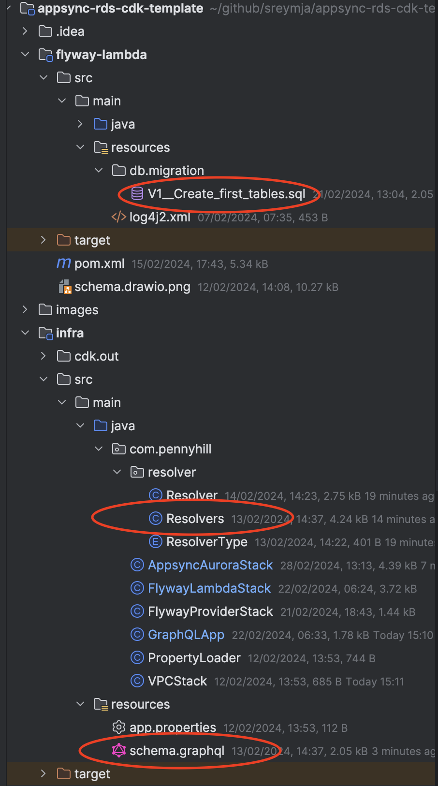

# Adventures with the CDK – AppSync

Infrastructure as code has been a bit of an issue for me in the serverless space.
Serverless often blurs the lines between what I always felt was devops 
(i.e. setting up things like clusters or databases) and setting up functionality 
(endpoints and routing). 
If I chose to use terraform to set up ApiGateway for example the endpoint definitions (route etc)
would be in HCL. 
That just felt like moving code that we’d expect to be written in a programming language like Java
to a scripting language. That tends to lose the power of programming, 
e.g., reusable code, loops etc. Also, it turns off programmers, 
nobody gets excited producing reams of boilerplate in a DSL. 
You have the same problem, but possibly worse, with CloudFormation. 
CloudFormation is defined in YAML, but the schema is incredibly verbose. 
It takes a surprisingly large amount of YAML to set up anything.

I was fortunate enough recently to work with a team already using [Serverless](https://www.serverless.com/). 
Serverless aims to reduce the amount of YAML you have to write by producing some stripped down YAML
of their own to produce some common patterns, for example a SQS queue with a lambda consumer. 
This was an improvement from plain CloudFormation but once the stack got big became unwieldy. 
Even when we used serverless-compose and split up the stacks it was still painful. 
We talked about migrating our serverless YAML to typescript, we talked about [SST](https://sst.dev/),
and we talked about the [CDK](https://aws.amazon.com/cdk/). 
There wasn’t the time to refactor it before I left the team so I can’t tell you how that went 
but once I had some free time, I decided to check the options out myself.

At this point I had three options Serverless, SST and CDK. 
Both Serverless and SST are written in typescript and currently use the CDK behind the scenes
(though SST do [plan to move away from it soon-ish](https://sst.dev/blog/moving-away-from-cdk.html)).

According to the docs the CDK supports TypeScript, Python, Java, .NET, and Go (in Developer Preview). 
I spend most of my time as a Tech Lead and more often than not Java (or at least a JVM language) 
is what we’re writing the backend in so for no better reason than that I thought I’d use the CDK
and write it in Java.

I’ve heard some good things about [AppSync](https://aws.amazon.com/appsync/) recently, 
so I thought I’d give it a go. AppSync is serverless a GraphQL API technology. 
It’s also possible to host a serverless GraphQL API on AWS using ApiGateway with a Lambda 
used to marshal the GraphQL sources. AppSync however can be used without the need for an extra 
Lambda using RDS resolvers to house the queries that back up the GraphQL schema.

If you want to do the CDK in the JVM space then AWS only supports code written in Java using maven
as the build tool. Since doing this I set up a CDK project to deploy an ApiGateway API all written
in Kotlin using gradle, but as this was my first go, I thought I’d go along with the docs to start
with.

### Getting Started
I'm not sure how useful the AWS docs are for [getting started with the CDK](https://docs.aws.amazon.com/cdk/v2/guide/getting_started.html)
but follow the link and have a read by all means, all I really had to do was install CDK before I got started
```shell
npm install -g aws-cdk
```
## Apps & Stacks
To start off with you'll need a main class to house your app in
```java
public class GraphQLApp {
    public static void main(final String[] args) {
        App app = new App();
```
You then set up the environment and add stacks to the app
```java
Environment environment = Environment.builder()
        .account(System.getenv("CDK_DEFAULT_ACCOUNT"))
        .region(System.getenv("CDK_DEFAULT_REGION"))
        .build();

VPCStack vpcStack = new VPCStack(app, prefix + "graphql-vpc-stack", 
        StackProps.builder()
            .env(environment)
            .build());

AppsyncAuroraStack auroraStack = new AppsyncAuroraStack(app, 
        prefix + "appsync-aurora-stack", 
        AppsyncAuroraStack.AppsyncAuroraStackProps.builder()
            .env(environment)
            .vpc(vpcStack.getVpc())
            .build());

FlywayLambdaStack lambdaStack = new FlywayLambdaStack(app, 
        prefix + "flyway-lambda-stack", 
        FlywayLambdaStack.FlywayLambdaStackProps.builder()
            .env(environment)
            .vpc(vpcStack.getVpc())
            .cluster(auroraStack.getCluster())
            .rdsSecret(auroraStack.getRdsSecret())
            .dbName(auroraStack.getDbName())
            .build());
```
As you can see I've got three stacks the VPCStack, AppsyncAuroraStack and FlywayLambdaStack

### VPC Stack
The VPC stack is really simple since it just contains the VPC
```java
this.vpc = new Vpc(this, "TheVPC", VpcProps.builder()
        .maxAzs(2)
        .build());
```
The created VPC is then exposed back to the other stacks since we'll need to reference 
it in the other stacks.
```java
@Getter
public class VPCStack extends Stack {

    private final Vpc vpc;
```

### Appsync Aurora Stack
If this were a production app we might consider splitting this into two stacks
one for the database and one for the API. You're not going to change the Aurora (DB) part of the stack
contents very often. I'm using an RDS secret stored in secrets manager to
connect to the DB. I'm using the ServerlessCluster for this but for an app intended for
production you'd probably use the DatabaseCluster. The difference is that for
the serverless option we don't have to set up server instance details for our cluster as it's
serverless. The serverless cluster will scale to zero so it may be an option for non-prod
environments but it doesn't support the same range of DB versions as the full
provisioned offering so I doubt I'd use it outside a demo like this where that doesn't matter.
```java
rdsSecret = new Secret(this, "GraphQLAuroraRDSPassword", 
        SecretProps.builder()
        .secretName("graphql-aurora-rds-cred")
        .generateSecretString(SecretStringGenerator.builder()
                .excludePunctuation(true)
                .passwordLength(16)
                .generateStringKey("password")
                .secretStringTemplate("{\"username\": \"" + DB_USER_NAME + "\"}")
                .build())
        .build());

cluster = new ServerlessCluster(this, "GraphQLAuroraCluster", 
        ServerlessClusterProps.builder()
        .engine(DatabaseClusterEngine.AURORA_POSTGRESQL)
        .parameterGroup(ParameterGroup
            .fromParameterGroupName(this, "ParameterGroup", "default.aurora-postgresql11"))
        .vpc(props.getVpc())
        .enableDataApi(true)
        .vpcSubnets(SubnetSelection.builder()
                .subnetType(SubnetType.PRIVATE_WITH_EGRESS)
                .build())
        .defaultDatabaseName(dbName)
        .credentials(Credentials.fromSecret(rdsSecret))
        .build());
```
the second part of the stack is the API
```java
GraphqlApi api = new GraphqlApi(this, "AppSyncRDSResolver", 
        GraphqlApiProps.builder()
        .name("AppsyncRDSResolverAPI")
        .definition(Definition.fromFile("src/main/resources/schema.graphql"))
        .authorizationConfig(AuthorizationConfig.builder()
                .defaultAuthorization(AuthorizationMode.builder()
                        .authorizationType(AuthorizationType.API_KEY)
                        .apiKeyConfig(ApiKeyConfig.builder()
                                .expires(Expiration.after(Duration.days(365)))
                                .build())
                        .build())
                .build())
        .build());

RdsDataSource ds = api.addRdsDataSource("AuroraDS", cluster, rdsSecret, dbName);

```
Firstly we set up the GraphqlApi class and load in a schema defined in a
graphql file with the types defined in the [graphql type language](https://graphql.org/learn/schema/#type-language).
For example the getTicket query is set up in the query type like
```graphql
type Query {
    getTicket(id: ID!): Ticket
```

Then we set up the RDS resolvers for each query. Originally that looked a bit like this
repeated for each query or mutation
```java
ds.createResolver(BaseResolverProps.builder()
        .fieldName("getTicket")
        .typeName("Query")
        .requestMappingTemplate(MappingTemplate.fromString("{\n" +
                "    \"version\": \"2018-05-29\",\n" +
                "    \"statements\": [\n" +
                "        \"select * from tickets where id = '$ctx.args.id'\"\n" +
                "    ]\n" +
                "}"))
        .responseMappingTemplate(MappingTemplate.fromString("#if($ctx.error)\n" +
                "    $utils.error($ctx.error.message, $ctx.error.type)\n" +
                "#end\n" +
                "#set($output = $utils.rds.toJsonObject($ctx.result)[0])\n" +
                "#if ($output.isEmpty())\n" +
                "  null\n" +
                "#else \n" +
                "  $utils.toJson($output[0])\n" +
                "#end"))
        .build());
```
That seemed a bit much and there was a lot of repeated code so I pulled that out
and now they look more like this
```java
// Queries
new Resolver("getTicket", Query, 
             "select * from tickets where id = '$ctx.args.id'"),
```
Which isn't perfect but does reduce the work for each query and make it more readable.
The resolvers are listed in a separate file and loaded into the stack from there
```java
getResolvers().forEach(
    resolver -> ds.createResolver(
            resolver.getProps().getFieldName() + 
                resolver.getProps().getTypeName(), 
            resolver.getProps())
);
```
Which gives us 3 files where code changes happen because as we develop the app


Two too many in my book because all the queries and graphql schema could be 
generated from the sql schema. I may circle back to that later in a future post
but it'll do for V1. Which leads us to our third and final stack...

### Flyway Lambda Stack
How do we do migrations in a serverless world? Before we could just use Flyway
or Liquibase to deploy them as the webserver we were hosting our microservice on
spin up. But we don't have a webserver any more and we don't want to add
to our lambda spin up times by checking for un-deployed migrations at the start of every lambda.
From a "could you put this in production?" perspective I think you'd want to do the migrations
after the database but before any API changes. So I'd probably split the Appsync Aurora Stack
as discussed above and put the flyway stack between the two. Something else for a future version.

As with all db migration approaches what you put in any migration has to be compatable
with the version you are replacing and the version you're deploying next. If that means
you need to do a few deployments to get the DB where you want it to be then so be it.

The stack sets up a lambda function
```java
function = new Function(this, "FlywayLambda", FunctionProps.builder()
        .role(lambdaRole)
        .memorySize(1024)
        .vpc(props.getVpc())
        .securityGroups(props.getCluster().getConnections().getSecurityGroups())
        .runtime(Runtime.JAVA_11)
        .environment(Map.of("RDS_SECRET", props.getRdsSecret().getSecretArn(),
                "CLUSTER_ARN", props.getCluster().getClusterArn(),
                "DATABASE_NAME", props.getDbName())
        )
        .code(Code.fromAsset("../flyway-lambda/target/flyway-lambda-0.0.1-SNAPSHOT.jar")) // the version number needs to be managed in the real world to ensure the redeploy of new versions
        .handler("com.pennyhill.FlywayLambdaHandler::handleRequest")
        .timeout(Duration.seconds(140))
        .build());
```
which is just a wrapper around
```java
flyway.migrate();
```
then we set up a provider and custom resource that calls the lambda as part of the
stack deployment.
```java
Provider flywayProvider = new Provider(this, "AppSyncAuroraStackFlywayProvider", ProviderProps.builder()
        .onEventHandler(function)
        .build());

CustomResource cr = new CustomResource(this, "AppSyncAuroraStackFlywayCustomResource", CustomResourceProps.builder()
        .serviceToken(flywayProvider.getServiceToken())
        .resourceType("Custom::FlywayProvider")
        .build());
```
The migrations live in the usual resources folder location and that's all there is to it

### What's left to get to production
For a start we'd need to look at a Route53 dns record pointing to the graphql api
so we don't have a random amazon.com url. Then any network and security group
settings to expose the api to its consumers.
You'd also need to be looking at how you want to authenticate, 
right now it's using an api key but that's not going to work
if you're using it as a backend for a UI. If it's a website consuming
it then you'd need to add CORS settings to the API.
If it's public you'll probably have a list of things to do from a Pen Tester.
If it's internal make sure that the traffic only leaves the VPC via the
organisations' preferred route (in AWS usually a transit gateway joining up all the traffic
across all the organisations accounts)

### Useful links

