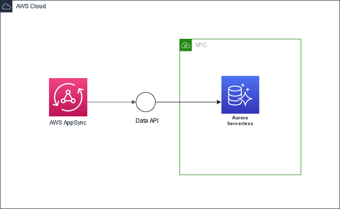

# appsync-rds-cdk-template
A starter project for a graphql appsync endpoint with RDS resolvers and a Aurora postgres db

## TODO
1) scripts to run locally with local stack
2) local tests (localstack??)
3) rest api gateway template
4) post deploy tests